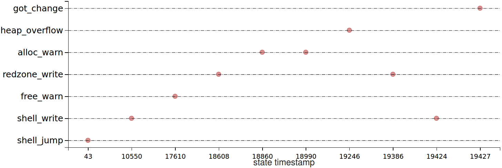
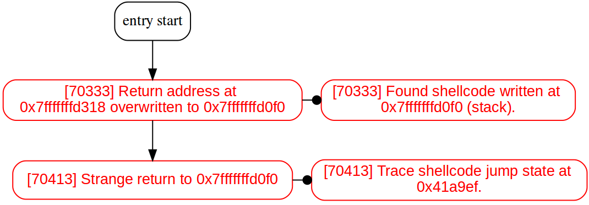

## abnormal behavior time graph

+ In this picture, the abscissa is the timing, and the ordinate is the abnormal type label.

### global labels

| abnormal behavior label | meaning        |
| ----------------------- | -------------- |
| tips                    | auxiliary tips |

### call_analysis labels

| abnormal behavior label | meaning                      |
| ----------------------- | ---------------------------- |
| ret_address_overwrite   | return address modification  |
| strange_return          | abnormal return              |
| unrecorded_ret          | undocumented abnormal return |

### heap_analysis labels

| abnormal behavior label | meaning                             |
| ----------------------- | ----------------------------------- |
| malloc                  | *malloc* function's information     |
| free                    | *free* function's information       |
| alloc_warn              | abnormal behavior during allocation |
| free_warn               | abnormal behavior during release    |
| heap_overflow           | heap overflow                       |
| redzone_write           | write inaccessible memory area      |

### got_analysis labels

| abnormal behavior label | meaning                    |
| ----------------------- | -------------------------- |
| got_mismatch            | errors of the GOT's entry  |
| got_change              | GOT's entries are modified |

### leak_analysis labels

| abnormal behavior label | meaning                         |
| ----------------------- | ------------------------------- |
| leak                    | information leakage exists      |
| leak_trace              | location of information leakage |

### shellcode_analysis labels

| abnormal behavior label | meaning                                   |
| ----------------------- | ----------------------------------------- |
| shell_write             | shellcode is written to the stack or heap |
| shell_jump              | jump to shellcode from normal address     |

## abnormal behavior flow diagram

+ "[]" indicates the timing of the current information in the program execution flow.